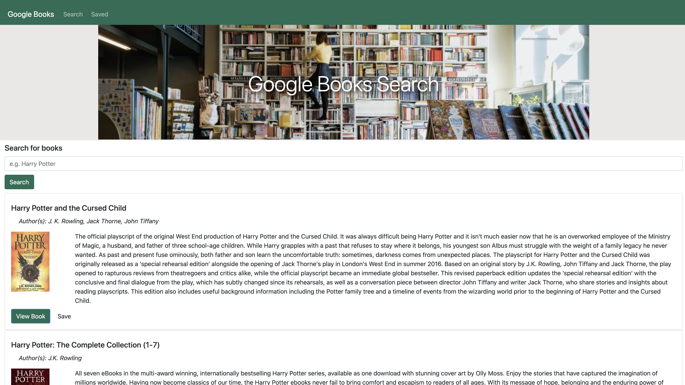

# Google Book Search

## Description ✏️

The Google Book Search is a React-based Google Books Search app. This application allows the user to query and display books based on user searches.
### User Story:

````
As a user...

I want to be able search for books utilizing google books 
So that I can get a list of book results returned from a book query search.

I want to be able to be able to save books
So that I can see a list of books I have saved from my book searches.
````
https://karm3nz.github.io/Google-Books-Search/ 




## Table of Contents 📜

* [Installation](#installation)
* [License](#license)

## Installation 
💾

### Steps:

1) Make sure to have properly functioning computer.
2) Check if an internet browswer is installed. If so, go to step 4).
3) Install an internet browser of your choice. 
4) Open up internet web browser.
5) In the address bar, type in : https://karm3nz.github.io/Google-Books-Search/  and hit "enter" on the keyboard.

## License 
🛡️

MIT License

Copyright (c) [2021] [Carmen Hui]

Permission is hereby granted, free of charge, to any person obtaining a copy
of this software and associated documentation files (the "Software"), to deal
in the Software without restriction, including without limitation the rights
to use, copy, modify, merge, publish, distribute, sublicense, and/or sell
copies of the Software, and to permit persons to whom the Software is
furnished to do so, subject to the following conditions:

The above copyright notice and this permission notice shall be included in all
copies or substantial portions of the Software.

THE SOFTWARE IS PROVIDED "AS IS", WITHOUT WARRANTY OF ANY KIND, EXPRESS OR
IMPLIED, INCLUDING BUT NOT LIMITED TO THE WARRANTIES OF MERCHANTABILITY,
FITNESS FOR A PARTICULAR PURPOSE AND NONINFRINGEMENT. IN NO EVENT SHALL THE
AUTHORS OR COPYRIGHT HOLDERS BE LIABLE FOR ANY CLAIM, DAMAGES OR OTHER
LIABILITY, WHETHER IN AN ACTION OF CONTRACT, TORT OR OTHERWISE, ARISING FROM,
OUT OF OR IN CONNECTION WITH THE SOFTWARE OR THE USE OR OTHER DEALINGS IN THE
SOFTWARE.


